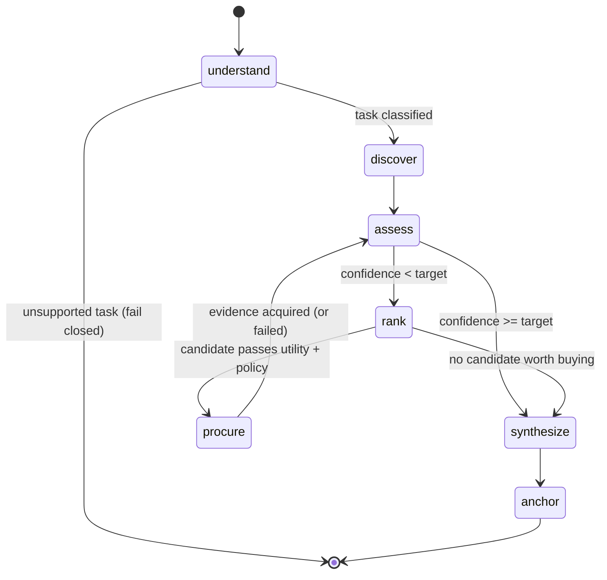

# Ledger402 — Agentic Loop Design

This document covers the work that starts where [PLAN.md](PLAN.md) stopped. The morning MVP
delivered a real commercial loop (`x402` → XRPL Testnet settlement) driven by a **linear state
machine**. This phase replaces that state machine with a real agent, without touching the payment
path that already works.

## The governing principle

> **The LLM never decides to spend money.**

Every economic decision — which providers exist, what a purchase is worth, whether policy allows
it, and whether to settle on-ledger — stays **deterministic, unit-tested, and inspectable**. The LLM
is confined to two bounded jobs:

| Job | Node | Fallback when no `GROQ_API_KEY` |
| --- | --- | --- |
| Understand the business question | `understand` | Deterministic keyword classifier |
| Write the final analyst report from purchased evidence | `synthesize` | Deterministic template |

This is the direct answer to the challenge's *Trust, Governance & Agent Controls* section, and it is
what makes a live demo safe: an LLM outage or a hallucination can degrade the prose, never the
spend.

## Why LangGraph

The morning loop could not branch. This one can: it buys, **re-measures its own uncertainty**, and
decides whether to buy again. That is a graph with a cycle, which is exactly what LangGraph is for,
and it is on the hackathon's recommended stack.



The `procure → assess → rank → procure` cycle is the agentic core. `assess` recomputes confidence
from the **evidence actually received**, not from registry metadata, so a provider that returns weak
data does not get credit for what it promised.

## Node contracts

### `understand`
Classifies the question into a `task_type` and extracts the subject entity (the port). Fails closed
on unsupported tasks — an unrelated question must never be answered with Port X evidence.

### `discover`
Filters the provider registry by task category. Deterministic, no LLM. This is where a real
directory or x402 discovery protocol would plug in later.

### `assess`
Computes confidence from the current evidence set via signal coverage (see below). Emits the
uncertainty gap that drives the loop.

### `rank`
The genuinely new economic reasoning. The morning MVP scored one provider against a fixed utility
threshold; with only one paid option that was not a decision. Ranking is now **need-aware**:

```
marginal_gain(p)  = projected_confidence(evidence ∪ p) - current_confidence
efficiency(p)     = marginal_gain(p) / price_drops
```

Candidates are ranked by `efficiency` — confidence bought per drop spent. A candidate is bought only
if **all** hold:

1. `marginal_gain >= MIN_MARGINAL_GAIN` — the purchase must actually move the answer
2. `current_confidence < target_confidence` — we still need evidence at all
3. `policy.check(...)` passes — budget, per-purchase cap, allowed category
4. it has not already been purchased in this run

`decision.utility()` is retained as a quality prior recorded in the audit log, so the morning MVP's
explainability (and its tests) survive.

### `procure`
Unchanged: [ledger402/payment.py](ledger402/payment.py). Observe a real HTTP 402, pay via the
official `x402_requests` client, decode the tx hash. Process-local idempotency on
`run_id + provider_id`.

### `synthesize`
Writes the analyst answer grounded **only** in evidence the agent actually holds. The prompt carries
the evidence JSON and forbids outside facts.

### `anchor`
Implements pillar 2 of the deliverable spec:

```
H_audit = SHA-256(dossier_summary ‖ ⊕ tx_hash_i ‖ timestamp)
```

The XOR-fold over transaction hashes makes the anchor order-independent across the run's
settlements. The anchor is returned in the response so a compliance auditor can verify the report
was derived from paid, on-ledger feeds rather than hallucinated.

## Confidence model

Confidence is **signal coverage**, quality- and freshness-adjusted. Each task type declares the
signals a confident answer requires, with weights summing to 1.0. A source contributes the weight of
the signals it supplies, scaled by its own credibility:

```
credibility(source) = quality_score × max(0, 1 - freshness_hours / FRESHNESS_HORIZON_HOURS)
coverage            = Σ  weight(signal) × credibility(source providing it)
confidence          = FLOOR + SPAN × coverage
```

`FLOOR` represents the value of having any evidence at all; `SPAN` scales the rest. `FLOOR = 0.56`
and `SPAN = 0.511` are **calibrated** so the canonical Port X scenario reproduces the documented
demo figures — public-only lands on 58%, public + satellite on 87%. This is an explainable
heuristic, not a statistical claim, and it is stated as such in the UI.

## Why a second premium provider changes the demo

With one paid option, "ranking" was theatre. The registry now carries two, with deliberately
different economics:

| Provider | Price | Quality | Freshness | Signals supplied |
| --- | --- | --- | --- | --- |
| Satellite Logistics Intelligence | 1200 drops | 0.93 | 3 h | yard utilization, anchored vessels, container density, truck activity |
| Terminal Operations Telemetry | 600 drops | 0.81 | 6 h | gate turnaround, rail dwell |

At the default `target_confidence = 0.85` the agent buys satellite only, reaches 87%, and **stops** —
the documented morning demo is preserved exactly. Raise the target to 0.92 and the same agent, with
no code change, buys the telemetry feed as a second on-ledger settlement and reaches ~92%.

That contrast is the demo: **the spend is a consequence of the objective, not a hardcoded script.**

## Configuration

```dotenv
GROQ_API_KEY=                       # optional; absent = deterministic fallbacks
GROQ_MODEL=llama-3.3-70b-versatile
GROQ_BASE_URL=https://api.groq.com/openai/v1
LEDGER402_TARGET_CONFIDENCE=0.85
LEDGER402_MAX_PURCHASES=3           # hard ceiling on settlements per run
TELEMETRY_PROVIDER_URL=http://localhost:8003
```

`LEDGER402_MAX_PURCHASES` is a safety rail, not a tuning knob: it bounds worst-case spend per run
even if the confidence model or a provider misbehaves.

## Honesty

**Real:** x402, XRPL Testnet settlement, the payment path, the graph, the economic gates, LLM
classification and synthesis when a key is present.

**Synthetic:** all provider data, provider identities, ODRL terms, commercial pricing. The
confidence model is a calibrated heuristic, not a validated forecasting model.
