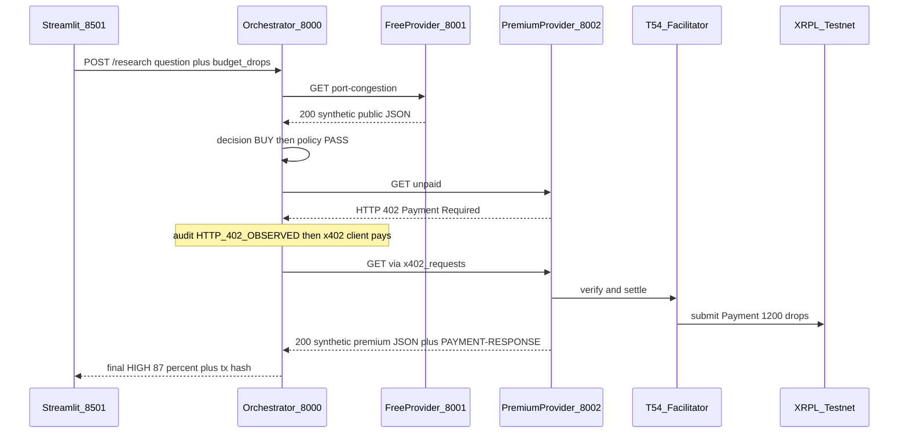

# Ledger402 Morning MVP

## Product story (do not lose this)

Ledger402 is **not** a dataset marketplace demo. It is an **autonomous intelligence procurement agent**.

The user asks a **business question**:

> Assess whether Port X is becoming congested.

The user does **not** ask "buy satellite data."

The agent is responsible for:

- what evidence it already has
- whether that evidence is sufficient
- what additional information exists
- whether that information is worth its price
- whether policy allows the purchase
- whether to execute the transaction

Core loop:

```text
information need
  → provider discovery
  → economic evaluation
  → policy approval
  → x402 procurement
  → better business answer
```

Payment is part of the workflow, not the product.

Provider data is **fully synthetic**. x402 + XRPL Testnet settlement is **real**.

### What "agent" means in the morning MVP

Product framing: autonomous intelligence procurement agent.

Technical reality: a **deterministic autonomous workflow / state machine**, not an LLM agent, not LangChain, not LangGraph.

MVP agentic behavior = a deterministic decision loop with tool/API calls, budget policy, provider discovery, and payment execution. That is the reliability choice for tomorrow morning.

LangGraph becomes justified later if the loop is: discover many providers → buy one → reassess uncertainty → buy another if needed → branch / retry / ask for approval → continue until a research threshold. Do not imply LangChain/LangGraph is in this architecture.

### Morning MVP scope: one task type

The morning MVP is **not** a general research agent. It supports one demo scenario:

`task_type = port_congestion`

That means: Port X (or equivalent port-congestion) data, port congestion providers, templated 58% → 87% analysis.

The UI can still show the natural question:

> Assess whether Port X is becoming congested.

`POST /research` should require `task_type: "port_congestion"` (or default only that type). Unsupported questions must **not** return Port X congestion evidence. Example: "Should we enter the Japanese market?" must fail closed (400 / unsupported task), not "yard utilization 91%, HIGH congestion."

Future versions can add task classification and more provider categories.

## Current repo assessment

This workspace is the SingHacks Ripple **starter**, not an app. There is no Python project, no Makefile, no `.env`, no existing x402 experiment, and no vendored `x402-secure` clone.

Leave alone:

- Challenge docs: [README.md](README.md), [resources.md](resources.md)
- Feedback hook: [hook/](hook/), [.cursor/hooks.json](.cursor/hooks.json)
- Agent skill indexes: [skills/xrpl-agentic-resources/](skills/xrpl-agentic-resources/)

**Reusable application code from this repo: none.** Reuse official x402-xrpl APIs, not guessed ones.

Verified payment stack (do not substitute):

- Package: `x402-xrpl==0.3.3` (import `x402_xrpl`), Python **3.11+**
- Merchant: `from x402_xrpl.server import require_payment` then `app.middleware("http")(require_payment(...))`
- Buyer: `from x402_xrpl.clients import x402_requests, decode_payment_response` (PyPI also shows `x402_xrpl.clients.requests` / `clients.base` — confirm import after `make install`)
- Network: `xrpl:1` = Testnet
- Facilitator (server only): `https://xrpl-facilitator-testnet.t54.ai`
- RPC: `https://s.altnet.rippletest.net:51234/`
- Tx hash: `decode_payment_response(...).get("transaction")` — confirm key at runtime
- Buyer clients do **not** take a facilitator URL
- SDK pins `fastapi>=0.115,<0.116`
- `t54-labs/x402-secure` is a risk/VI layer, **not** the payment SDK. Skip it tonight
- RLUSD / Verifiable Intent: out of scope for morning (cleaner 5 / 1.20 monetary story later if we add RLUSD)

Demo amounts are **real Testnet microtransactions**, not generic "units":

- Data procurement budget: **5000 drops / 0.005 XRP**
- Dataset / premium query price: **1200 drops / 0.0012 XRP**
- Procurement budget remaining: **3800 drops / 0.0038 XRP**
- All **procurement** arithmetic uses **integer drops**
- Convert drops → XRP only for display

The 5000-drop figure is a **data-procurement budget**. It does **not** include the XRPL network transaction fee. Displayed remaining budget (3800 drops) is `5000 - 1200`, not "XRP removed from the buyer wallet."

XRPL network fee: track **separately** if the SDK / `PAYMENT-RESPONSE` / decoded settlement exposes it. Surface it in transaction/audit info when available. Do not subtract it from `budget_drops`. If the fee is not observable, omit it rather than guessing.



## First-time setup (do not merge wallet into install)

Keep three Make targets. Expected first-time flow:

1. `make install`
2. `cp .env.example .env`
3. `make wallet-setup`
4. Copy the printed buyer seed and merchant address into `.env`
5. `make dev-start`

Do **not** merge wallet creation into `make install`.
Do **not** auto-overwrite `.env`.
Do **not** require manual `.venv` activation.

Every Make target uses `.venv/bin/python` and `.venv/bin/pip` internally.

If `.env` is missing or `XRPL_WALLET_SEED` / `XRPL_PAY_TO` are blank, `make dev-start` and `make pay-once` fail with:

```text
XRPL wallet configuration missing.
Run `make wallet-setup`, copy the printed values into `.env`,
then run `make dev-start` again.
```

## Exact files to create

Same layout. No Docker, DB, Redis, or extra packages.

- [PLAN.md](PLAN.md)
- [Makefile](Makefile) — `install`, `wallet-setup`, `dev-start`, `test`, `pay-once`
- [README.md](README.md) — Ledger402 run instructions + honest real vs synthetic; keep challenge text
- [.env.example](.env.example)
- [.gitignore](.gitignore) — `.venv/`, `.env`, `__pycache__/`, `.pytest_cache/`
- [requirements.txt](requirements.txt)
- [scripts/dev-start.sh](scripts/dev-start.sh)
- [scripts/wallet_setup.py](scripts/wallet_setup.py)
- [scripts/pay_once.py](scripts/pay_once.py)
- [data/free_port_data.json](data/free_port_data.json)
- [data/premium_satellite_data.json](data/premium_satellite_data.json)
- [data/providers.json](data/providers.json)
- [apps/orchestrator/main.py](apps/orchestrator/main.py)
- [apps/free_provider/main.py](apps/free_provider/main.py)
- [apps/premium_provider/main.py](apps/premium_provider/main.py)
- [apps/ui/app.py](apps/ui/app.py) — M1 placeholder; replace with research UI at M8
- [ledger402/__init__.py](ledger402/__init__.py)
- [ledger402/models.py](ledger402/models.py)
- [ledger402/providers.py](ledger402/providers.py)
- [ledger402/decision.py](ledger402/decision.py)
- [ledger402/policy.py](ledger402/policy.py)
- [ledger402/payment.py](ledger402/payment.py)
- [ledger402/audit.py](ledger402/audit.py)
- [ledger402/agent.py](ledger402/agent.py)
- [tests/test_decision.py](tests/test_decision.py)
- [tests/test_policy.py](tests/test_policy.py)
- [tests/test_providers.py](tests/test_providers.py)
- [tests/test_agent_fallback.py](tests/test_agent_fallback.py)

Do not change hook/skill files.

**One source of truth for provider URLs.** Bases live in `.env`; `providers.json` holds metadata + path + which env var to use. Do not duplicate full `http://localhost:...` URLs in both places. Decision/payment code must resolve `base_url_env` + `path` at runtime. HTTP boundaries stay clean so services could be deployed separately later. Do not add Terraform/Docker/cloud tonight.

## Dependencies

```
x402-xrpl==0.3.3
xrpl-py>=4.1.0
fastapi>=0.115,<0.116
uvicorn[standard]>=0.30,<0.31
python-dotenv>=1,<2
requests>=2,<3
httpx>=0.28.1
pydantic>=2,<3
streamlit
pytest
```

`make install`: create `.venv` if missing, install deps, idempotent, fail if Python < 3.11.

## Env

`.env.example` (blank secrets, microtx price):

```
XRPL_RPC_URL=https://s.altnet.rippletest.net:51234/
XRPL_NETWORK=xrpl:1
XRPL_FACILITATOR_URL=https://xrpl-facilitator-testnet.t54.ai
XRPL_WALLET_SEED=
XRPL_PAY_TO=
XRPL_PRICE_DROPS=1200
FREE_PROVIDER_URL=http://localhost:8001
PREMIUM_PROVIDER_URL=http://localhost:8002
```

`XRPL_WALLET_SEED` = buyer seed. `XRPL_PAY_TO` = merchant classic address.

`FREE_PROVIDER_URL` / `PREMIUM_PROVIDER_URL` are **base URLs only** (scheme + host + port). Paths live in `providers.json` via `base_url_env` + `path`. `XRPL_PRICE_DROPS` is the on-chain middleware price and must match the premium provider's `price_drops`.

**Strict boundary:**

- [ledger402/decision.py](ledger402/decision.py) — "Should we purchase?" Never sees the seed.
- [ledger402/policy.py](ledger402/policy.py) — "Are we allowed to purchase?" Never sees the seed.
- [ledger402/payment.py](ledger402/payment.py) — "Execute approved purchase." Only module that reads the seed. Never decides worth.

## `make wallet-setup`

Create/fund one **buyer** Testnet wallet and one **merchant** Testnet wallet.

Prefer the official **xrpl-py Testnet faucet helper** if present after install. Only parse faucet JSON if that helper is missing or insufficient.

Do **not** write or overwrite `.env`. Print credentials for the user to copy.

Print this block:

```text
==================================================
Ledger402 XRPL Testnet Setup
==================================================

BUYER ADDRESS:
r...

BUYER SEED — PRIVATE:
s...

MERCHANT ADDRESS:
r...

Copy these values into `.env`:

XRPL_WALLET_SEED=<buyer seed>
XRPL_PAY_TO=<merchant address>

The following can remain unchanged from `.env.example`:

XRPL_RPC_URL=https://s.altnet.rippletest.net:51234/
XRPL_NETWORK=xrpl:1
XRPL_FACILITATOR_URL=https://xrpl-facilitator-testnet.t54.ai

IMPORTANT:
- Never commit the buyer seed.
- `.env` must be gitignored.
- Buyer and merchant addresses are public.
- Merchant seed is not required by the application for the current MVP.
==================================================
```

Merchant seed is unused by the app (receive address only). Buyer must be funded.

## Implementation rules

### Health

Every FastAPI app exposes `GET /health` → `{"status":"ok","service":"..."}`.

`dev-start.sh` may warn if a URL is unreachable after a few seconds. No process supervisor.

### `make dev-start`

[scripts/dev-start.sh](scripts/dev-start.sh) starts:

- orchestrator `:8000`
- free provider `:8001`
- premium provider `:8002`
- Streamlit `:8501`

Print URLs, trap SIGINT/SIGTERM, kill children on Ctrl+C. Fail clearly on missing `.env` or blank wallet values.

### Synthetic data (everywhere)

Both providers are mocked. Every payload includes `"synthetic": true`.

Do not integrate SkyFi, Planet, Bloomberg, FactSet, real port APIs, or any proprietary source tonight.

Streamlit disclaimer:

> Demo uses synthetic provider intelligence. x402 and XRPL settlement are real on Testnet.

### Provider registry

[data/providers.json](data/providers.json) fields:

- `id`, `name`, `category`, `payment_required`
- `base_url_env` (`FREE_PROVIDER_URL` or `PREMIUM_PROVIDER_URL`)
- `path` (e.g. `/intelligence/port-congestion`)
- `price_drops`, `freshness_hours`, `quality_score`
- `expected_information_gain`, `description`

Premium example:

```json
{
  "id": "satellite-logistics-intel",
  "name": "Satellite Logistics Intelligence",
  "category": "port_congestion",
  "base_url_env": "PREMIUM_PROVIDER_URL",
  "path": "/intelligence/port-congestion",
  "payment_required": true,
  "price_drops": 1200,
  "freshness_hours": 3,
  "quality_score": 0.93,
  "expected_information_gain": 0.35
}
```

No full duplicated local URLs. No reputation, crypto identities, discovery network, onboarding, ratings, or bidding.

Morning discovery/filtering (not marketplace ranking): `task_type` / category → find compatible providers → evaluate utility. One free + one premium is enough. Do not pretend single-provider selection is ranking. Ranking tests/UI wait until 2+ premium providers with different price/freshness/quality/gain.

### Free provider `:8001`

`GET /intelligence/port-congestion` → 200 synthetic public JSON.

### Premium provider `:8002`

Protect only that path with `require_payment(price="1200", ...)`.

Unpaid GET → **real HTTP 402**. Valid x402 payment → 200 synthetic premium JSON. Do not fake 402.

### Decision vs policy vs payment

Decision ([ledger402/decision.py](ledger402/decision.py)) is deterministic, no LLM. Tune default Port X so premium is BUY.

```text
utility =
  0.40 * information_gain
+ 0.25 * quality_score
+ 0.20 * freshness_score
- 0.15 * normalized_price
```

The formula is explainable, not scientific. Tests: default BUY; high price SKIP; low gain SKIP; budget too small SKIP.

Policy ([ledger402/policy.py](ledger402/policy.py)) separately checks integer drops:

- `price_drops <= remaining_budget_drops`
- `price_drops <= max_single_purchase_drops` (e.g. 2000)
- category allowed (`port_congestion`)

Payment never decides. Decision/policy never hold the seed.

### Analysis (templated, no LLM)

Initial: congestion MODERATE/UNCLEAR, confidence 58%.

After premium: HIGH, 87%, evidence yard 91%, anchored +31%, container +24%.

### Visible 402 + payment path

For research and `make pay-once`:

1. Plain unpaid `requests.get` → record/display the **real HTTP 402**
2. Then use the official `x402_requests` client for the paid request
3. Decode `PAYMENT-RESPONSE` for the actual XRPL tx hash

Do **not** assume the first unpaid GET's invoice/payment requirements are reused by `x402_requests`. That client may negotiate internally. Do **not** reimplement x402 just to force invoice reuse. Reliability first.

Do not claim the first observed invoice ID was the settled invoice unless the SDK confirms that.

Audit trail **only claims states we can observe**. `x402_requests` may encapsulate submit vs validate. Default safer sequence:

- `HTTP_402_OBSERVED` — unpaid GET returned 402
- `X402_PAYMENT_NEGOTIATION_STARTED` — we invoked the official paying client
- `XRPL_PAYMENT_CONFIRMED` — paid request succeeded and a tx hash was decoded
- `PREMIUM_RESOURCE_UNLOCKED` — HTTP 200 + synthetic JSON

Do **not** emit `XRPL_PAYMENT_SUBMITTED` / `XRPL_PAYMENT_VALIDATED` unless the SDK gives a reliable hook that distinguishes those. If a network fee appears in the decoded settlement, attach it to `XRPL_PAYMENT_CONFIRMED` as a separate field; do not fold it into procurement remaining budget.

No on-chain report hashes, ODRL, or permanent audit storage.

### Process-local payment idempotency

In-memory cache keyed by `run_id + provider_id` with state:

- `NOT_STARTED`
- `PENDING`
- `SUCCESS`
- `FAILED` — we know no successful payment occurred
- `UNKNOWN` — the HTTP/client call failed after the tx **may** already have been submitted or settled

Before initiating a payment, set `PENDING`. If another request for the same key sees `PENDING`, `SUCCESS`, or `UNKNOWN`, do **not** issue another XRPL payment.

- `SUCCESS` → reuse previous premium result / tx hash
- `PENDING` → return/reuse current purchase state, do not pay again
- `FAILED` → do not auto-retry in the same run
- `UNKNOWN` → do not auto-retry; return a safe public-only fallback. No reconciliation tonight.

Hackathon/process-local only. Document in README. No DB or Redis.

### `POST /research`

```json
{
  "run_id": "optional",
  "task_type": "port_congestion",
  "question": "Assess whether Port X is becoming congested.",
  "budget_drops": 5000
}
```

`task_type` must be `port_congestion` for the morning MVP (default that value if omitted, **reject** any other type). If the question is clearly not port-congestion, fail closed rather than answering with Port X templates.

If `run_id` omitted, generate one and return it. Idempotency is **process-local** (document in README). No Redis/DB. `budget_drops` is the data-procurement budget only.

### Failure

Never crash the research request. On insufficient budget, policy reject, provider down, `FAILED`, or `UNKNOWN` payment, return public-only analysis (~58%) with reason, e.g. `premium_purchase: FAILED` or `UNKNOWN`, `fallback: PUBLIC_ONLY`.

### `make pay-once` (only live integration test)

Load `.env`, unpaid GET (print 402), pay, unlock, print JSON + hash + explorer URL:

```text
Premium provider:
Satellite Logistics Intelligence

Initial response:
402 Payment Required

Amount:
1200 drops / 0.0012 XRP

Payment:
SUCCESS

Transaction:
ABC123...

Explorer:
https://testnet.xrpl.org/transactions/ABC123...

Premium intelligence:
{...}
```

**M4 is the hard stop and the main technical proof of the product.** If this path is broken, do not build the research UI or anything beyond fixing payment. The M1 placeholder Streamlit may keep running. Everything after M4 is substantially less valuable if this flow is unreliable.

### Tests

`make test` **never** spends Testnet XRP. Mock the payment boundary.

Cover: BUY, SKIP (high price / low gain), insufficient budget, max purchase, category/path filtering (not multi-provider ranking), free payload, unpaid 402 where practical, provider-fail fallback, duplicate-purchase prevention, unsupported `task_type` rejection.

### Streamlit

**M1:** placeholder page so `make dev-start` can always start `:8501`:

```text
Ledger402
Morning MVP under construction

Backend services are running.
```

Do not build the real research UI until M8.

**M8:** replace/expand the placeholder with the chronological checklist (including observed 402), sidebar 0.005 / 0.0012 / 0.0038 XRP, hash, explorer link, synthetic disclaimer.

## Sequential milestones

### M0 — PLAN.md

- **Accept:** this plan is in [PLAN.md](PLAN.md)
- **Verify:** `test -f PLAN.md`

### M1 — local setup

- **Accept:** `make install` creates `.venv` and installs; `make wallet-setup` prints buyer/merchant block and does not write `.env`; `make dev-start` starts **four** processes including a **placeholder** Streamlit on `:8501`, prints URLs, clean Ctrl+C; missing wallet values fail with the copy-into-`.env` message
- **Verify:** `make install && cp .env.example .env && make wallet-setup` then (after paste) `make dev-start` and Ctrl+C

### M2 — free provider

- **Accept:** 200 + `"synthetic": true` + `/health`
- **Verify:** `curl -sS http://localhost:8001/intelligence/port-congestion` and `/health`

### M3 — real premium 402

- **Accept:** unpaid GET is HTTP 402, not a fake JSON error
- **Verify:** `curl -i http://localhost:8002/intelligence/port-congestion | head`

### M4 — real x402/XRPL microtransaction (HARD STOP)

- **Accept:** `make pay-once` shows 402 → payment → 200 → tx hash → explorer URL; hash exists on Testnet
- **Verify:** `make pay-once`
- **Stop here if this fails.** Do not build the agent, M8 research UI, or extra providers. Keep the M1 placeholder UI as-is.

### M5 — premium synthetic unlock

- **Accept:** paid body is satellite JSON with `"synthetic": true`
- **Verify:** inspect `make pay-once` body

### M6 — decision + policy

- **Accept:** default Port X → BUY; high price / low gain / over max / over budget → SKIP; arithmetic in drops
- **Verify:** `make test` for decision/policy tests

### M7 — `POST /research` complete loop

- **Accept:** `task_type=port_congestion` only; free 58% → BUY → policy PASS → `HTTP_402_OBSERVED` → 1200-drop payment → unlock → HIGH 87% + hash + procurement remaining 3800 drops; `run_id` returned; second call same `run_id` does not pay twice; non-port questions fail closed
- **Verify:** `curl -sS -X POST http://localhost:8000/research -H 'Content-Type: application/json' -d '{"task_type":"port_congestion","question":"Assess whether Port X is becoming congested.","budget_drops":5000}'`

### M8 — Streamlit research UI

- **Accept:** placeholder replaced; Run Research shows checklist (including observed 402), HIGH/87%, sidebar 0.005 / 0.0012 / 0.0038 XRP, hash, synthetic disclaimer
- **Verify:** open http://localhost:8501 after M4/M7 work

### M9 — tests + honest README

- **Accept:** listed unit tests pass with no live payments; README states what is real vs synthetic and the process-local idempotency limit
- **Verify:** `make test`

## Morning-demo cutoff

Priority: M1 → M2 → M3 → **M4** → M5 → M6 → M7 → M8 → M9.

Viable prototype if **M0–M7** work. Streamlit is strongly preferred but secondary to the backend loop.

Minimum acceptable tomorrow morning:

```text
make install
cp .env.example .env
make wallet-setup
# copy printed XRPL_WALLET_SEED and XRPL_PAY_TO into .env
make dev-start
```

Then one research run shows:

synthetic free evidence → initial 58% → premium discovered → utility BUY → policy PASS → real HTTP 402 → real XRPL Testnet microtransaction (1200 drops) → synthetic premium unlocked → final 87% → transaction hash displayed.

If M4 is broken, stop and fix payment.

## README honesty

**Real:** x402, XRPL Testnet settlement, deterministic procurement loop, budget policy, HTTP provider architecture.

**Synthetic:** port data, satellite data, provider identities, commercial pricing assumptions.

**Not in the MVP:** a general-purpose research agent, LLM/LangChain/LangGraph, multi-provider marketplace ranking, XRPL fee deducted from the procurement budget.

**Production vision:** replace mocked x402 providers with real commercial data providers exposing granular pay-per-query APIs. Do not imply current satellite-company integrations.

## Explicitly out of scope tonight

Real datasets or satellite APIs; RLUSD; LLM reports; LangChain/LangGraph; database/Redis; Docker; auth/accounts; provider onboarding; decentralized discovery; tokenomics; smart contracts; ODRL/compliance; on-chain report storage/hashes; x402-secure VI; multiple agents; production custody; Terraform/AWS/Vercel/Railway/Render/Fly/K8s.
